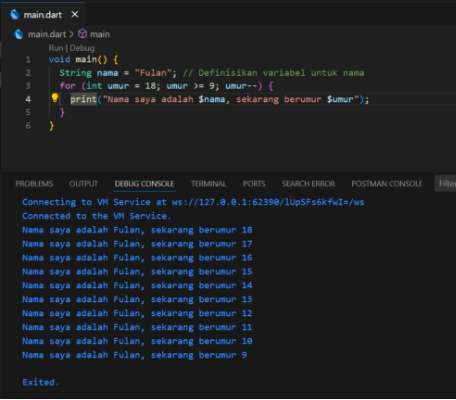


Tugas Praktikum

**Soal 1**

Modifikasilah kode pada baris 3 di VS Code atau Editor Code favorit Anda berikut ini agar mendapatkan keluaran (*output*) sesuai yang diminta!

**Soal 2**

Mengapa sangat penting untuk memahami bahasa pemrograman Dart sebelum kita menggunakan framework Flutter ? Jelaskan!

pemahaman yang kuat tentang Dart akan sangat membantu Anda dalam jangka panjang. Dengan menguasai Dart, Anda akan menjadi pengembang Flutter yang lebih produktif dan kompeten.

**Soal 3**

Rangkumlah materi dari codelab ini menjadi poin-poin penting yang dapat Anda gunakan untuk membantu proses pengembangan aplikasi mobile menggunakan framework Flutter.

Jawab :

**Aplikasi dalam Flutter**

- Pemahaman tentang **OOP** sangat penting karena Flutter memanfaatkan **class** dan **object** untuk mengelola widget dan state dalam aplikasi.
- Operator-operator Dart membantu dalam **manipulasi data** dan **logika kontrol** dalam aplikasi Flutter.
- **Type safety** di Dart membuat pengembangan lebih aman dengan mengurangi potensi bug dari tipe data yang tidak sesuai.

Ini adalah landasan dasar yang penting untuk dipahami saat mengembangkan aplikasi mobile dengan Flutter.

